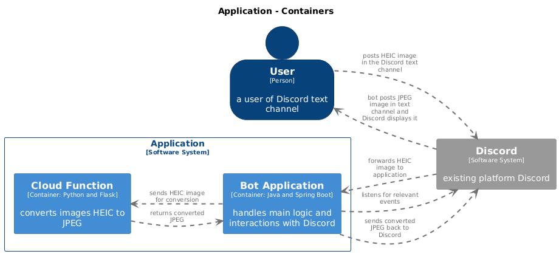

# Discord Bot (App) for HEIC Image Conversion
This repository contains a Discord App designed for automated conversion of HEIC format image files 
to JPEG images within Discord text channels.

## Overview

On Discord, HEIC files are treated as regular files rather than images, which prevents them from 
being previewed and embedded in the text like other image formats. This can be inconvenient and
annoying, so I developed a custom solution to enhance the user experience.

In this implementation, when a HEIC format attachment is uploaded in a text channel, the app 
converts it to a JPEG image. The bot then posts the converted image in the same text channel.

The project is developed with Java Spring Boot using Java Discord API and built with Gradle. 
The app is deployed on Google App Engine.

The image conversion service is separated from the app, developed as a Google Cloud Function written
in Python with Flask and using Pillow for image processing. It communicates with the 
app via HTTP requests. Runtime Python 3.11.

## Project Structure

- `.github/workflows/`: Contains GitHub Actions workflows for continuous integration.
- `cloud-function/`: Contains the Google Cloud Function script and its dependencies.
    - `main.py`: The Cloud Function script.
    - `requirements.txt`: The dependencies required for the Cloud Function.
- `src/`: Contains the Java source code.
- `build.gradle`: The Gradle build file.

## Deployment
The deployment configuration for Google App Engine is specified in the app.yaml file. Manual instance 
scaling is used to ensure continuous operation, as there is no direct traffic to the app (the app 
does not have its own endpoints to serve). Google App Engine performs periodic health checks to
assess the app's liveness, so a REST controller is implemented to respond to these health checks.

## Sensitive Data Handling

Sensitive data for the project is specified as environment variables. The handling of these variables 
is as follows:

- **Google Cloud Function:**
  - Environment variables are set directly during the initial deployment process.

- **Spring Boot Application:**
  - Local Development:
    - Environment variables are loaded from a `.env` file. The `application.properties` file contains 
    the configuration to load these variables and placeholders for reference.
  - Deployment:
    - Environment variables are specified in the `app.yaml` file.

## Container diagram
